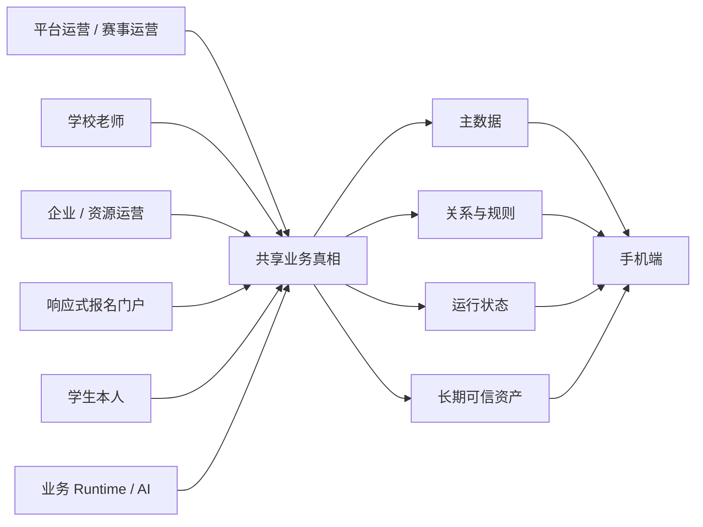
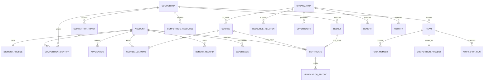
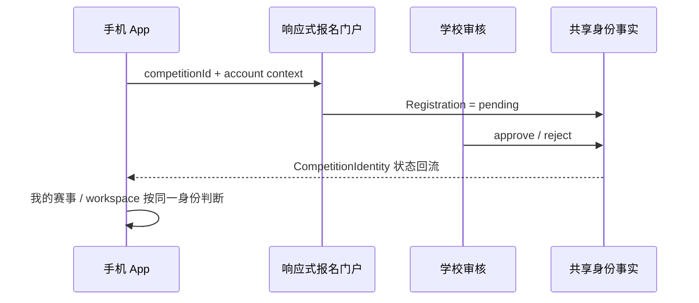
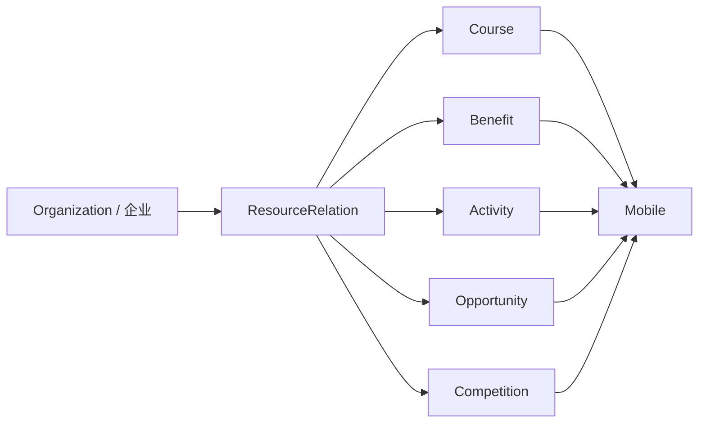

# 03｜PC 管理端数据骨架

> 状态：Current Skeleton / 可继续施工  
> 分支：`dev`  
> 目的：定义 PC 管理系统如何为手机端提供主数据、关系、运营配置、业务状态和长期资产支持。  
> 本文不是数据库 Schema，也不是“把手机端页面复制到桌面”；它优先回答：**谁管理什么数据、谁能改、手机在哪里消费、数据在业务生命周期里如何流转。**

---

## 1. 核心定位

PC 管理端的职责不是“桌面版学生 App”，而是：

> **管理人、主体、资源、规则、关系与可信状态，为手机端提供稳定的数据真相源和运营控制面。**

现有 `/registration-portal/*` 继续作为三创赛响应式报名业务入口，它负责报名、团队、审核和报名状态回流，但它不等于整个 PC 管理系统。

当前 PC 端明确分成两类入口：

```text
/admin/*                  数据运营 / 管理控制面
/registration-portal/*    学生响应式报名业务入口
```

二者可以共享稳定业务 ID、状态语义与后续 API，但不要求共用一套页面结构。

---

## 2. 为什么现在必须先补 PC 数据层

手机端已经快速演进出大量业务对象：

- 赛事；
- 企业 / 学校 / 合作资源方；
- 机会；
- 课程；
- 权益；
- 内容 / 活动；
- 学生主档；
- 多赛事身份；
- 团队与项目；
- 成绩、证书、经历；
- 创赛工坊 Skill / Task / Result。

当前其中相当一部分仍由 mobile mock / 静态 TS 数据直接提供。

继续只扩手机端会产生三个直接风险：

1. **数据无来源**：页面能演示，但不知道谁在后台维护；
2. **关系无控制面**：企业、赛事、课程、权益等关系只能写死；
3. **状态无权威写入方**：审核、资格、成绩、证书、赛事身份等会出现多个“看起来都是真的”来源。

所以 PC 管理端现阶段最重要的目标不是“后台功能多”，而是：

> **让手机端每一个长期存在的业务对象，都能回答“这个数据从哪里来”。**

---

## 3. 总体数据流



这里的“共享业务真相”不是要求现在立即建设真实后端，而是先建立**唯一语义和唯一责任边界**。

原型阶段可以继续使用前端 mock，但 mock 必须模拟未来真实数据归属，而不是每个页面各自造数据。

---

## 4. 数据对象分层

### 4.1 主数据 Master Data

相对稳定、被多业务复用的对象：

- Account / StudentProfile
- Organization
- School
- Company
- Competition
- CompetitionTrack
- Opportunity
- Course
- Benefit
- Activity
- Content

主数据通常不应被某个单一页面私有持有。

### 4.2 关系与规则 Relations / Rules

决定对象如何连接、适用于谁：

- Competition ↔ Track
- Competition ↔ SchoolScope
- Competition ↔ Organization
- Organization ↔ Resource
- Resource ↔ Competition
- Resource ↔ Region / SchoolScope
- Benefit ↔ EligibilityRule
- Account ↔ CompetitionIdentity[]
- Course ↔ Benefit unlock
- Content / Activity ↔ Organization / Competition / Region

### 4.3 运行状态 Runtime State

随业务行为变化：

- Registration
- CompetitionIdentity
- Team / TeamMember / TeamChange
- CompetitionProject
- Application
- CourseLearning
- BenefitClaim / Redeem
- WorkshopRun
- Notification / Support handoff

### 4.4 长期资产 Long-term Assets

赛事、课程或活动结束后仍需要存在的事实：

- Experience
- Result
- Certificate
- VerificationRecord
- CourseAchievement
- 可引用的项目摘要 / 团队角色

核心原则继续保持：

> **赛事会结束，赛事期权限会回收，但人的长期可信事实不会随赛事一起消失。**

---

## 5. 核心对象关系图

这不是最终 ERD，只用于当前原型施工统一语义。



### 重要解释

- `Organization` 是 PC 管理端的统一资源主体概念，可代表企业、学校、赛事组织方、合作机构；
- 它**不等价**于旧手机 `/me/subjects` 的 D08“主体管理”；
- `CompetitionIdentity` 必须保持“账号 × 具体赛事”的关系对象；
- `Team / Project / WorkshopRun` 都属于赛事上下文，不应脱离 `competitionId` 成为全局对象。

---

## 6. 第一阶段管理域

## A. 赛事中心

### 管理对象

- Competition
- CompetitionTrack
- CompetitionLifecycle
- CompetitionResource
- SchoolScope
- 赛事关联 Organization

### PC 负责

- 创建 / 编辑赛事基础资料；
- 配置报名期、进行期、结束期；
- 配置赛道；
- 配置参与学校 / 区域范围；
- 配置赛事资料；
- 关联赛事专属课程、权益、活动、企业资源；
- 查看赛事当前身份 / 团队规模概况。

### 手机消费

- `/competitions`
- `/competitions/:competitionId`
- `/competitions/:competitionId/workspace`
- workspace 内资料、权益、工坊入口

### 首版不做

- 不把完整报名表重新做进管理端；
- 不在赛事中心复制学生报名事实；
- 不把某场三创赛字段硬编码为所有赛事必填字段。

---

## B. 主体与学校

### 管理对象

统一 `Organization` ID，至少覆盖：

- 企业；
- 学校；
- 赛事组织方；
- 合作机构 / 资源提供方。

企业附加：

- 工商可信信息；
- 品牌资料；
- 可信状态；
- 对外展示信息。

学校附加：

- 地区；
- 赛事授权范围；
- 老师 / 审核角色范围。

### 核心关系

企业 / 组织方不是孤立详情页，应能关联：

```text
赛事 / 课程 / 权益 / 活动 / 机会 / 内容
```

### 手机消费

- 企业详情；
- 赛事资源归属；
- 课程来源；
- 权益来源；
- 活动主办方；
- 机会发布方。

### 首版不做

- 不急于建设企业自运营 SaaS；
- 不因为学校重要就建设学校独立门户体系；
- 不把 Organization 与 D08 手机“主体”业务混为一谈。

---

## C. 资源运营

### 管理对象

- Opportunity
- Course
- Benefit
- Activity
- ResourceRelation
- EligibilityRule

### 统一字段原则

不同资源各有业务字段，但至少共享以下概念：

- stable id
- source organization
- status
- publish window
- effective window
- audience / scope
- competition relation
- region / school scope（如果有）
- operator

### 机会

管理：

- 实习 / 校招 / 项目实践；
- 企业；
- 城市；
- 技能要求；
- 开放 / 关闭；
- 投递外部 handoff（若有）。

### 课程

管理：

- 来源；
- 章节；
- 学习规则；
- 解锁方式；
- 证书关联。

### 权益

管理：

- 来源；
- 资格规则；
- 有效期；
- 领取 / 使用 / 核销语义；
- 后续兑换码 / 库存能力的位置。

### 活动

管理：

- 主办方；
- 时间地点；
- 地区 / 学校范围；
- 报名 / 签到 / 核销入口；
- 关联权益 / 内容。

### 关键原则

资源关系应成为真实数据，而不是手机端手写：

```text
company.resourceRelations = [...]
```

长期目标是由关系数据反向生成手机端展示。

---

## D. 学生与赛事身份

### 管理 / 查询对象

- Account
- StudentProfile
- CompetitionIdentity[]
- Registration
- CompetitionTeam
- TeamMember
- TeamChange
- Application

### 核心边界

```text
Account / StudentProfile = 长期的人
CompetitionIdentity       = 某个账号在某场赛事的身份
Registration              = 获得赛事身份前后的报名事实
Team / Project            = 某场赛事内的对象
Application               = 长期账号的机会投递事实
```

### PC 的主要职责

首期更偏“查询 + 审核 / 状态修正”，不是后台替学生填写所有资料。

至少应支持：

- 按学生、学校、赛事搜索；
- 查看长期 StudentProfile；
- 查看一个账号的多个赛事身份；
- 查看 pending / rejected / active / revoked；
- 查看对应报名、团队、学校审核结果；
- 查看团队变更申请；
- 查看投递状态及外部状态回流情况。

### 写入原则

学生自己的长期资料优先由学生写；运营仅补充被授权字段。

学校老师只可处理授权赛事 + 授权学校范围，不获得全平台学生管理权限。

---

## E. 资产与可信凭证

### 管理对象

- Experience
- Result
- Certificate
- VerificationRecord
- CourseAchievement

### PC 负责

- 查看 / 导入赛事成绩；
- 确认可信状态；
- 签发或撤销证书；
- 管理验真码；
- 关联成绩报告 / 文件；
- 处理异常凭证；
- 保留历史状态。

### 手机消费

- `/assets/experiences`
- `/assets/results`
- `/assets/certificates`
- `/assets/verification`
- 长期简历中的可信事实引用

### 删除原则

不能因为赛事下架、课程下架或企业退出合作，就直接删除已经属于学生的可信历史资产。

应优先：

```text
active → archived / revoked / invalid
```

而不是物理消失。

---

## F. 内容与活动

### 管理对象

- News / Announcement
- Story / 赛友内容
- Banner / 首页推荐位
- Activity
- Support entry / 人工客服 handoff

### 后续可承接

- 创域本地化活动；
- 地区 / 学校差异化内容；
- 扫码签到；
- 活动权益发放；
- 企业 / 学校 / 社团协作入口。

### 边界

目前“创域运营权、学校 / 社团是否可运营、区域权限模型”仍未完全确定。

因此 PC 可以先有 Activity / Content 数据位置，但不要提前造一套复杂多租户运营后台。

---

## G. 创赛工坊配置

### 管理对象

- WorkshopSkillConfig
- WorkshopTaskConfig
- MaterialRequirement
- PromptVersion
- ComputePolicy
- WorkshopRun observer
- ResultTemplate / output schema（如果需要）

### PC 管什么

- 某赛事启用哪些 Skill；
- Skill 下有哪些 Task；
- Task 前置材料；
- Prompt / 模板版本；
- 算力消耗规则；
- 生效时间；
- 某赛事是否允许执行；
- Runtime 状态观察与异常诊断。

### Runtime 不由 PC 伪造

真实运行仍由：

```text
competitionId
+ team / project
+ user answers
+ materials
+ runtime state
```

驱动。

后台配置的是“规则与版本”，不是把每个学生的 AI 结果人工录进去。

---

## 7. 权限角色骨架

现在不要求实现完整 RBAC，但所有 PC 页面施工前必须知道“谁在使用”。

### 平台运营

范围：全平台。

可管理：

- 赛事；
- 主体；
- 资源；
- 内容；
- 平台规则；
- 异常数据修正。

### 赛事运营

范围：授权赛事。

可管理：

- 赛事配置；
- 赛道；
- 赛事资料；
- 赛事资源；
- 身份 / 团队概况；
- 成绩 / 证书相关流程。

### 学校老师

范围：**授权赛事 + 授权学校**。

首要能力：

- 查看本校报名；
- 审核学生 / 团队真实性；
- 查看状态；
- 处理被授权的变更申请。

不得自动拥有企业、平台资源、全平台学生数据权限。

### 企业 / 资源运营

现阶段主要由平台代运营。

若未来开放企业自运营，权限只能限定为自己组织下的：

- 机会；
- 权益；
- 课程；
- 活动；
- 内容；
- 相关数据反馈。

首期不要求建设企业账号体系。

---

## 8. 写入责任矩阵

| 数据对象 | 权威写入方 | 可辅助写入 | 手机是否直接写 | 长期保留 |
| --- | --- | --- | --- | --- |
| Competition | 平台 / 赛事运营 | - | 否 | 是 |
| Organization | 平台运营 | 授权资源运营 | 否 | 是 |
| StudentProfile | 学生本人 | 授权运营补充 | 是 | 是 |
| Registration | 报名门户 / 学生 | 学校审核 | 间接 | 是 |
| CompetitionIdentity | 报名 / 审核状态机 | 授权运营修正 | 否 | 历史保留 |
| Team | 学生 / 报名门户 | 审核方 | 是 / handoff | 赛后摘要保留 |
| Opportunity | 平台 / 企业运营 | - | 否 | 历史可归档 |
| Application | 学生 | 外部系统状态回流 | 是 | 是 |
| Course | 平台 / 课程运营 | 企业共建方 | 否 | 是 |
| CourseLearning | 学习 Runtime | - | 是 | 是 |
| Benefit | 平台 / 资源运营 | 企业 / 活动方 | 否 | 是 |
| BenefitRecord | 权益 Runtime | 核销方 | 是 | 是 |
| Result | 赛事 / 课程可信方 | 授权运营 | 否 | 是 |
| Certificate | 可信签发方 | 授权运营 | 否 | 是 |
| WorkshopTaskConfig | 赛事 / AI 运营 | - | 否 | 版本保留 |
| WorkshopRun | Task Runtime | - | 触发 | 按规则保留 |

---

## 9. 管理端页面应该围绕什么设计

后台不能机械按数据库表做菜单。

一个管理页面至少应同时呈现三种信息：

1. **对象本身是什么**；
2. **它与谁关联**；
3. **修改它会影响手机哪里**。

例如企业详情后台不应该只有工商字段，而应能看到：

```text
北辰美妆
├─ 基础 / 工商可信信息
├─ 关联赛事
├─ 提供权益
├─ 共建课程
├─ 活动
├─ 机会
└─ 当前发布状态
```

赛事后台也不只是赛事标题表单，而应是：

```text
赛事
├─ 生命周期
├─ 赛道
├─ 学校范围
├─ 报名门户配置
├─ 赛事资源
├─ 课程 / 权益 / 企业关系
├─ 学生身份 / 团队概况
└─ 成绩 / 证书出口
```

---

## 10. 首期 CRUD 最小范围

骨架不等于所有对象立即做完整增删改查。

第一阶段优先：

| 管理域 | Create | Read | Update | Delete / Archive |
| --- | --- | --- | --- | --- |
| 赛事 | 是 | 是 | 是 | Archive |
| 企业 / Organization | 是 | 是 | 是 | Archive |
| 学校 | 可先预置 | 是 | 是 | Archive |
| 机会 | 是 | 是 | 是 | Close / Archive |
| 课程 | 是 | 是 | 是 | Archive |
| 权益 | 是 | 是 | 是 | Expire / Archive |
| 活动 / 内容 | 是 | 是 | 是 | Unpublish / Archive |
| 学生主档 | 否 | 是 | 有限字段 | 否 |
| 赛事身份 | 否 | 是 | 状态修正 | 否 |
| 团队 | 否 | 是 | 审核型修改 | 否 |
| 成绩 / 证书 | 导入 / 签发 | 是 | 状态管理 | Revoke / Archive |
| Workshop Config | 是 | 是 | 新版本 | Disable / Archive |

### 为什么尽量不用 Delete

大量对象已经被长期资产、投递、证书、报名或历史经历引用。

因此后台默认采用：

- unpublish
- close
- expire
- revoke
- archive

而不是直接物理删除。

---

## 11. 两条关键数据回流示例

### 11.1 报名 → 赛事身份



这里不能出现：

- Portal 一份报名状态；
- Mobile 又手写一份赛事身份；
- PC 管理后台再造一份审核状态。

后台只是观察 / 操作同一个状态模型。

### 11.2 企业资源 → 手机发现



手机企业页所展示的“企业参与了什么”，应逐步由真实关系反向生成，而不是企业详情自行维护一份重复列表。

---

## 12. 明确不建的管理域

### 不建“万能任务后台”

手机 `/tasks` 已确认是聚合层，只从：

- CompetitionIdentity / lifecycle
- Workshop Runtime
- CourseLearning
- BenefitRecord
- Application

推导下一步。

因此 PC 端不创建新的通用 `Task` 真相源。

如果以后确实存在独立运营任务，应先完成 D03 业务模型决策，再确定它与赛事任务、企业任务、权益任务和奖励模型的关系。

### 不把 `/me/subjects` 的旧主体管理直接搬进 PC

D08 的主体业务语义仍待确认。

本文的 `Organization` 是后台资源 / 权限 / 可信主体主数据，不等于旧手机“主体管理”。

### 不在本轮确定学力值经济模型

积分、成长分还是双对象仍属于 F04 产品决策。

PC 骨架不得提前创建：

- 学力值余额；
- 收支流水；
- 看广告赚积分；
- 统一任务奖励。

除非业务决策已经确认。

### 不先建设复杂多租户后台

学校、企业、赛事组织方未来可能有不同后台权限，但现阶段先验证真实运营方式。

不要为了“看起来像完整 SaaS”提前做：

- 租户套餐；
- 企业工作台；
- 学校独立站；
- 复杂组织树；
- 多级审批引擎。

---

## 13. 原型阶段的数据实现原则

目前仍是可交互原型，不要求立即建设真实数据库。

但从现在开始，新 PC 管理能力和手机能力应尽量遵循：

### 1. stable ID 优先

关系使用 ID：

```text
competitionId
organizationId
courseId
benefitId
opportunityId
studentAccountId
```

不要复制整个对象形成第二真相源。

### 2. mock 也要模拟真实归属

例如赛事列表数据即使暂时仍在 TS 文件中，也应视为未来由赛事管理后台维护，而不是某个手机页面自己的数据。

### 3. 状态必须有来源

任何状态都应该知道是谁产生的：

```text
published       → 运营
pending         → 报名提交
approved        → 学校审核
claimed         → 用户领取
used            → 核销 Runtime
trusted         → 可信签发流程
completed       → 学习 / AI Runtime
```

### 4. PC 不持有第二份手机状态

后台可以展示、筛选、审核、修正；不能复制一份独立状态然后“同步过去”。

---

## 14. 后续施工顺序

当前 `/admin/*` 已经有可点击的数据责任骨架。

建议下一步按小卡施工，不做“大后台一次完成”。

### P0｜先让核心手机数据有后台出处

```text
A01 赛事中心
A02 Organization / 企业 / 学校
A03 资源运营：机会 + 课程 + 权益
A04 学生 / 赛事身份查询与审核视图
```

### P1｜补长期闭环

```text
A05 成绩 / 证书 / 验真
A06 内容 / 活动
A07 团队变更与学校审核支撑
```

### P2｜再做高复杂度控制面

```text
A08 创赛工坊配置台
A09 本地化活动 / 创域运营规则确认后的后台支持
```

每张卡只解决一个数据域，不顺手建立新的全局业务模型。

---

## 15. 每个管理域施工前必须回答的 10 个问题

1. 管理的真实业务对象是什么？
2. stable ID 是什么？
3. 谁创建？
4. 谁能修改？
5. 谁能审核 / 改状态？
6. 手机哪些页面 / 状态消费？
7. 与哪些对象通过关系连接？
8. 下架 / 结束 / 撤销后什么必须保留？
9. 是否重复创建已有 session / identities / lifecycle / application / runtime 真相源？
10. 当前 mobile mock 中哪些字段未来应迁到这个管理域？

如果这 10 个问题答不清，不应急着画后台 CRUD 页面。

---

## 16. 验收底线

PC 管理端后续每新增一块真实管理能力，至少满足：

- 有明确业务对象和 stable ID；
- 有权威写入方；
- 有可解释的权限范围；
- 手机消费位置明确；
- 关系不是靠页面重复手写；
- 状态改变有来源；
- 没有第二份 account / identity / application / workshop truth source；
- 结束 / 下架 / 撤销不会误删长期可信事实；
- 当前原型若仍使用 mock，要明确 mock 对应未来哪个管理域；
- build / browser 验证必须区分“测试已写”和“测试真实执行通过”。

---

## 17. 当前实现位置

当前骨架代码：

```text
apps/pc/src/admin/
```

当前路由：

```text
/admin
/admin/competitions
/admin/organizations
/admin/resources
/admin/students
/admin/assets
/admin/content
/admin/workshop
```

原有报名门户继续保留：

```text
/registration-portal/*
```

当前 `/admin/*` 的意义是建立**数据责任地图与后续施工入口**，不是宣称这些管理能力已经完整实现。