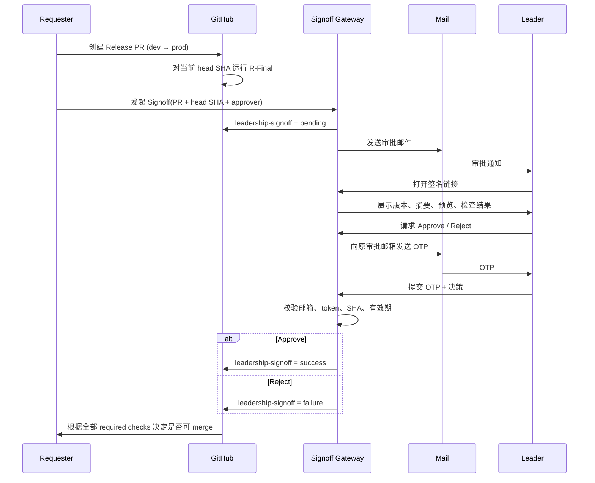

# 产业学院原型｜Leadership Signoff Gate 设计

> 状态：**Design / Proposed**  
> 日期：2026-08-17  
> 适用仓库：`dangjingtao/core-industry-college-prototype`  
> 适用分支：`dev → prod` 正式验收合并  
> 当前阶段只定义方案，不代表 Signoff 服务、GitHub Ruleset 或邮件能力已经上线。

---

## 1. 背景

当前仓库已经形成较清晰的工程验收链：

- `dev`：日常整合与验证；
- `prod`：已验收版本；
- `R-Final Full Regression`：覆盖 Mobile / PC 的 verify、浏览器回归和 Mobile-PC-Mobile handoff。

但工程验收与业务/领导验收不是同一件事。

R-Final 能回答：

> “这个 commit 是否通过既定自动化与浏览器回归？”

领导 Signoff 要回答：

> “这个已经通过工程验收的具体版本，是否可以作为正式原型版本进入 `prod`？”

当前缺口是：如果领导不是 GitHub 用户，或者不应被纳入仓库协作者权限体系，就没有一个轻量、可追溯、能真正阻止误合并的审批入口。

因此增加一个独立的 **External Leadership Signoff Gate**。

---

## 2. 核心决策

### 2.1 领导不要求拥有 GitHub 账号

领导通过已登记的第三方邮箱完成身份确认和审批。

支持的邮箱类型不做业务限制，例如：

- 企业邮箱；
- Outlook；
- QQ 邮箱；
- 163 等普通邮箱。

GitHub 账号、仓库成员身份、Pull Request Review 权限都不是领导审批的前置条件。

### 2.2 邮件只负责触达，不是审批真相源

不能把“领导回复邮件说同意”直接等价为 GitHub 可合并。

正式决策必须发生在 Signoff Gateway 中，并留下结构化记录：

- 审批对象；
- PR；
- 精确 commit SHA；
- 审批邮箱；
- Approve / Reject；
- 审批意见；
- 时间；
- 身份验证结果；
- 审计信息。

### 2.3 Signoff 必须绑定精确 commit SHA

审批对象不是“这个 PR 大概没问题”，而是：

```text
repo + pullRequest + headSha
```

例如：

```text
repo: dangjingtao/core-industry-college-prototype
pr: #128
headSha: a83fc91...
```

领导批准 `a83fc91` 后，如果 `dev` 又产生新提交、Release PR head 变成 `b917dd2`：

- `a83fc91` 的批准记录继续保留为历史事实；
- 但不能继承到 `b917dd2`；
- 新 SHA 必须重新通过工程检查并重新 Signoff。

**禁止“审批一次，后续继续改代码仍沿用批准”。**

### 2.4 Signoff 只卡正式 Release PR

MVP 不要求所有功能 PR 都经过领导审批。

目标流程是：

```text
feature / fix
    ↓
合入 dev
    ↓
R-Final on dev
    ↓
创建 Release PR: dev → prod
    ↓
Leadership Signoff
    ↓
满足全部 required checks
    ↓
merge → prod
```

原因：

- 领导审批是发布/交付决策，不是代码 Review；
- 避免日常开发频繁打扰领导；
- `prod` 本来就代表“已验收版本”，Signoff 与该语义一致。

### 2.5 GitHub 只消费最终 Gate 状态

GitHub 不需要理解第三方邮箱体系。

Signoff Gateway 负责把外部审批映射为一个稳定的 merge gate：

```text
leadership-signoff
```

状态语义：

| Signoff 状态 | GitHub Gate | 是否允许继续合并 |
|---|---|---|
| pending | pending | 否 |
| approved | success | 是，但仍需其他 required checks 通过 |
| rejected | failure | 否 |
| expired | failure | 否 |
| superseded | 当前 SHA 无 success | 否 |
| system_error | error / failure | 否 |

GitHub `prod` 分支最终应要求至少：

```text
R-Final
leadership-signoff
```

二者缺一不可。

---

## 3. 非目标

MVP 明确不做：

1. 不把领导加入 GitHub 仓库协作者；
2. 不要求领导学习 PR Review；
3. 不做通用 OA / BPM 审批平台；
4. 不做复杂多级会签；
5. 不把审批逻辑塞进 `apps/mobile` 或 `apps/pc`；
6. 不把 Signoff 当产业学院业务后台的一部分；
7. 不让 Signoff 绕过 R-Final；
8. 不允许管理员手工改数据库把 pending 直接改成 approved 后视为有效审批；
9. 不在审批完成后自动 merge，MVP 只负责解锁 merge gate。

---

## 4. 角色

### Requester

通常是产品/研发负责人或有权限准备正式版本的人。

责任：

- 确认 Release PR 已准备好；
- 发起 Signoff；
- 填写本次验收摘要；
- 确认预览地址可访问；
- 处理 Reject 后的修改与重新申请。

### Approver

领导/业务验收人。

不需要 GitHub 账号。

责任：

- 查看冻结版本信息；
- 打开原型预览；
- Approve 或 Reject；
- Reject 时填写原因。

### Signoff Gateway

外部审批网关，是审批记录和决策状态的真相源。

责任：

- 创建审批；
- 发送邮件；
- 验证审批人邮箱身份；
- 保证审批绑定 SHA；
- 记录审计事件；
- 写回 GitHub gate 状态；
- 处理过期、重复点击和旧 SHA。

### GitHub

代码与 merge gate 执行者。

责任：

- 保存 PR / commit；
- 运行工程检查；
- 根据 required status checks 阻止或允许合并。

---

## 5. 主流程



---

## 6. 发起 Signoff 的前置条件

MVP 发起审批前必须验证：

1. PR base 是 `prod`；
2. PR head 对应 `dev` 的待发布版本；
3. 已取得当前 PR `headSha`；
4. 当前 SHA 的 R-Final 已通过；
5. 原型预览地址已生成且可访问；
6. Approver 邮箱属于当前项目允许的审批人列表；
7. 当前 SHA 不存在仍有效的 approved Signoff。

如果 R-Final 未通过：

```text
禁止发起领导审批
```

不要让领导替工程回归兜底。

---

## 7. 审批页面

页面目标不是做“漂亮的 OA”，而是让领导 30 秒内知道自己在批准什么。

### 必须展示

```text
产业学院原型｜正式版本审批

目标：dev → prod
PR：#128
版本：a83fc91
申请人：Tomz
申请时间：2026-08-17 21:30

工程验收
✓ R-Final Passed

本次变更摘要
- ...
- ...
- ...

预览
[打开 Mobile 原型]
[打开 PC 原型]

审批意见
[________________________]

[驳回]        [批准进入 prod]
```

### UI 原则

- mobile-first，领导直接从邮件在手机打开也能完成；
- 不暴露 GitHub 的复杂工程概念；
- SHA 需要展示，但缩写即可，支持展开完整 SHA；
- 明确写出“批准的是当前版本，后续代码变化需要重新审批”；
- Approve 按钮不能在页面打开后直接完成动作；
- Reject 必填意见；
- Approve 意见可选；
- 已审批、已过期、已被新 SHA 替代的链接只能查看结果，不能再次决策。

---

## 8. 邮件设计

### 邮件标题

```text
【待审批】产业学院原型正式版本 Signoff · PR #128
```

### 邮件正文只承担四件事

1. 这是什么项目；
2. 谁申请；
3. 当前版本是什么；
4. 去哪里查看并审批。

示意：

```text
产业学院原型有一个版本等待你的正式验收。

目标：dev → prod
版本：a83fc91
申请人：Tomz
工程回归：R-Final Passed

[查看原型并审批]

本审批仅对上述版本有效；如代码发生变化，需要重新审批。
```

邮件正文不放“直接批准”按钮，避免转发邮件或安全扫描器误触导致审批完成。

---

## 9. 身份验证

### MVP：邀请链接 + 邮箱 OTP

第一步，邮件中的签名链接只能证明：

> 持有人拿到了这次审批邀请。

它不能单独证明：

> 当前操作人就是被指定的 Approver。

因此真正提交 Approve / Reject 时：

1. Gateway 向原始 `approverEmail` 发送 6 位 OTP；
2. OTP 有短有效期；
3. 输入正确 OTP 后才能提交决策；
4. OTP 只用于该 Signoff，不跨审批复用。

推荐默认：

- OTP 有效期：10 分钟；
- Signoff 邀请有效期：72 小时；
- 连续错误尝试达到阈值后短时锁定；
- 服务端只保存 OTP hash，不保存明文。

### 后续可升级

如果公司已有稳定身份体系，可改成：

- 企业 SSO；
- Microsoft / Google Workspace 登录；
- 企业微信 / 飞书身份。

但这不是 MVP 前置条件。

---

## 10. 状态机

```text
pending
  ├─ approve → approved
  ├─ reject  → rejected
  ├─ timeout → expired
  └─ new SHA → superseded
```

终态：

- `approved`
- `rejected`
- `expired`
- `superseded`

终态记录不可原地改写成另一个结果。

如果 Reject 后修复并重新申请：

```text
创建新的 Signoff record
```

而不是修改旧记录。

---

## 11. 数据模型

MVP 可使用一个主表加审计事件表。

### signoffs

```ts
interface SignoffRecord {
  id: string
  repo: string
  pullRequestNumber: number
  baseBranch: 'prod'
  headBranch: string
  headSha: string

  requester: string
  approverEmail: string

  title: string
  summary: string
  mobilePreviewUrl?: string
  pcPreviewUrl?: string

  status:
    | 'pending'
    | 'approved'
    | 'rejected'
    | 'expired'
    | 'superseded'

  decisionComment?: string

  createdAt: string
  expiresAt: string
  decidedAt?: string
}
```

### signoff_events

```ts
interface SignoffEvent {
  id: string
  signoffId: string
  type:
    | 'created'
    | 'email_sent'
    | 'page_opened'
    | 'otp_sent'
    | 'otp_verified'
    | 'approved'
    | 'rejected'
    | 'expired'
    | 'superseded'
    | 'github_status_written'
    | 'github_status_failed'

  at: string
  ipHash?: string
  userAgent?: string
  metadata?: Record<string, unknown>
}
```

不建议长期保存不必要的原始 IP；如需要审计，可保存短期日志或不可逆 hash。

---

## 12. API 边界

示意接口：

```text
POST /api/signoffs
GET  /signoff/:token
POST /api/signoffs/:id/request-otp
POST /api/signoffs/:id/decision
POST /api/github/webhook
GET  /api/signoffs/:id
```

### POST /api/signoffs

仅内部 Requester 可调用。

输入：

```json
{
  "repository": "dangjingtao/core-industry-college-prototype",
  "pullRequestNumber": 128,
  "approverEmail": "leader@example.com",
  "title": "产业学院原型 R-Final 正式验收",
  "summary": "本次正式版本变更摘要……",
  "mobilePreviewUrl": "https://...",
  "pcPreviewUrl": "https://..."
}
```

服务端自己从 GitHub 读取当前 `headSha`，**不信任调用者直接声明的 SHA**。

### POST /api/signoffs/:id/decision

输入：

```json
{
  "decision": "approve",
  "comment": "同意进入正式演示版本",
  "otp": "123456"
}
```

服务端提交前再次检查：

- Signoff 仍为 pending；
- token 有效；
- OTP 正确；
- 未过期；
- GitHub PR 当前 head SHA 仍等于 record.headSha；
- R-Final 对该 SHA 仍满足通过条件。

任何一项不满足都禁止写 `success`。

---

## 13. GitHub 集成

### 13.1 Gate 名称固定

```text
leadership-signoff
```

不要把领导姓名、邮箱写入 status 名称。

### 13.2 Release PR 上的目标行为

创建 Signoff：

```text
leadership-signoff = pending
```

Approve：

```text
leadership-signoff = success
```

Reject / Expire：

```text
leadership-signoff = failure
```

### 13.3 新 commit 自动失效

核心约束仍然是 SHA 绑定。

如果 Release PR head 变化：

1. 旧 Signoff 标记 `superseded`；
2. 旧 approval 不复制到新 SHA；
3. 新 SHA 没有 `leadership-signoff = success`；
4. merge 自动重新被阻止；
5. R-Final 通过后才能重新申请。

可通过 GitHub webhook 主动把旧 record 标记为 superseded；即使 webhook 暂时失败，新的 SHA 本身也不能继承旧 SHA 的 success。

### 13.4 当前 R-Final 的实现依赖

当前仓库 `.github/workflows/r-final-check.yml` 主要在 `push: dev` 时运行。

真正把 Signoff 作为 `prod` Release PR 的 required gate 前，需要补齐 PR 场景下的工程检查策略，至少保证：

> GitHub 能对“准备合入 prod 的那个精确 head SHA”判断 R-Final 是否通过。

可以选择：

- 让现有 R-Final 同时响应 `pull_request` 到 `prod`；或
- 新增一个轻量 Release Gate workflow，复用现有 R-Final 命令。

这一点属于实现任务，不在本设计文档中假装已经完成。

---

## 14. GitHub 凭证策略

### MVP

可以使用仅限本仓库、最小权限的自动化凭证写入 commit status，并通过部署环境 secret 保存。

要求：

- 不放前端；
- 不提交进仓库；
- 不使用个人高权限长期 token；
- 只给予 Signoff 所需的仓库权限；
- secret 泄露后可以独立吊销。

### 后续

如果 Signoff Gateway 要复用到多个仓库，升级为独立 GitHub App。

届时：

- 安装范围清晰；
- 每仓库授权；
- token 生命周期更可控；
- 可进一步使用 Checks API 展示更丰富的审批结果。

但产业学院 MVP 不为“未来可能多仓库”提前引入过重实现。

---

## 15. 部署边界

Signoff 是交付流程基础设施，不属于产业学院 Mobile / PC 产品本身。

因此：

```text
apps/mobile   ❌ 不放
apps/pc       ❌ 不放
业务 /admin   ❌ 不放
```

推荐作为独立部署单元：

```text
Signoff Gateway
├─ API
├─ Approval Page
├─ Mail Adapter
├─ GitHub Adapter
└─ DB
```

MVP 可用轻量 Serverless 方案，例如：

```text
Cloudflare Worker / Pages Functions
+ D1 / 其他小型数据库
+ SMTP / 邮件 API
```

技术选型可以根据公司现有账号和成本调整；本设计只约束能力边界，不把 Cloudflare 写成唯一实现。

---

## 16. 审计要求

每次审批至少能回答：

1. 谁发起；
2. 发给哪个审批邮箱；
3. 审批的是哪个 repo / PR；
4. 精确 SHA 是什么；
5. 当时 R-Final 状态；
6. 领导做了什么决定；
7. 意见是什么；
8. 什么时候做的；
9. 是否通过 OTP 验证；
10. GitHub status 是否成功写回。

审批记录不能因为 PR merge/close 而删除。

---

## 17. 异常处理

### 邮件发不出去

- Signoff 保持 pending；
- GitHub 保持 pending；
- Requester 可以 resend；
- resend 不创建第二条审批记录。

### 领导重复点击 Approve

决策接口必须幂等。

已经 approved 后再次提交：

- 返回已批准结果；
- 不创建第二次有效决策；
- 不重复改变 GitHub 状态。

### 领导打开旧邮件

若已 `superseded / expired / rejected / approved`：

- 页面展示历史结果；
- 不允许再次提交。

### GitHub 写回失败

不能把数据库 approved 就等价成 merge gate 已成功。

需要记录：

```text
approved decision
+ github_status_failed
```

并重试写回；在 GitHub 未实际出现 success 前，仍然不能 merge。

### PR 被关闭

未决 Signoff 自动取消/失效，不继续发送提醒。

---

## 18. Merge 规则

产业学院正式版本建议形成以下语义：

```text
prod = 工程验收通过 + 领导 Signoff 通过的版本
```

因此 `prod` 分支保护 / Ruleset 最终应做到：

```text
禁止直接 push
必须通过 Release PR
必须通过 R-Final
必须通过 leadership-signoff
```

MVP 不自动 merge。

Leadership Signoff 的作用是：

> **解除业务审批这一把锁。**

真正点击 Merge 仍由拥有 GitHub 合并权限的研发/负责人执行。

---

## 19. MVP 验收标准

### S01｜无 GitHub 账号可审批

给一个没有 GitHub 账号的测试邮箱发起 Signoff，能完成 Approve / Reject。

### S02｜Pending 真正阻止 Merge

Release PR 的当前 SHA 未批准时，`leadership-signoff` 不能为 success，`prod` 合并被阻止。

### S03｜批准只对当前 SHA 有效

批准 SHA-A 后 push SHA-B：

- SHA-A 的审批历史保留；
- SHA-B 不继承批准；
- Release PR 重新 blocked。

### S04｜Reject 真正阻止 Merge

Reject 后 GitHub gate 为 failure，并保存 Reject 意见。

### S05｜过期不可复用

超过有效期的邀请不能继续决策。

### S06｜身份验证有效

拿到审批链接但拿不到原审批邮箱 OTP 的人，不能完成 Signoff。

### S07｜工程检查不能被审批绕过

R-Final 未通过时：

- 不能新建有效 Signoff；或
- 即使存在历史审批，也不能为当前 SHA 写 success。

### S08｜审计完整

任一已完成审批均能追溯 repo、PR、SHA、邮箱、时间、结果和 GitHub 写回结果。

### S09｜接口幂等

重复点击、网络重试、重复 webhook 不产生多个有效批准。

### S10｜产品端零侵入

Mobile / PC 原型业务逻辑不因 Signoff 引入新的登录、角色或状态模型。

---

## 20. 建议实施拆分

### SG01｜Gateway 基础骨架

- Signoff record / event schema；
- 创建、读取、过期；
- 配置允许审批邮箱；
- 基础审批页。

### SG02｜GitHub Gate

- 读取 Release PR 当前 head SHA；
- 写 `leadership-signoff` 状态；
- 处理 SHA 变化；
- 配置 `prod` required gate；
- 补齐 R-Final 对 Release PR 精确 SHA 的检查。

### SG03｜Mail + Identity

- 审批通知邮件；
- 签名 token；
- OTP；
- resend / rate limit；
- Approve / Reject。

### SG04｜Hardening & Acceptance

- webhook / superseded；
- 幂等；
- GitHub 写回失败重试；
- 审计记录；
- S01–S10 验收。

四张卡按顺序施工，不在 SG01 顺手做通用审批平台。

---

## 21. 最终产品语义

Leadership Signoff 不是为了让领导“参与 GitHub”。

它要建立的是一条边界清楚的交付链：

```text
研发负责证明：这个版本工程上站得住。

领导负责确认：这个具体版本可以作为正式原型交付。

GitHub 负责保证：没有同时满足这两件事，就进不了 prod。
```

对产业学院当前阶段，这比把领导拉进 GitHub Reviewer 体系更符合真实协作方式，也保留了以后扩展到甲方验收、产品验收和多项目 Signoff 的空间。